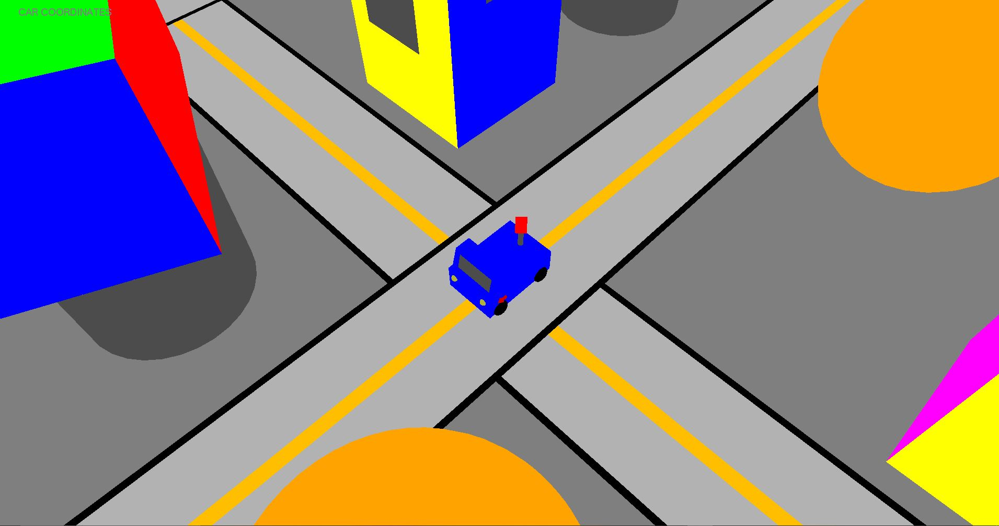
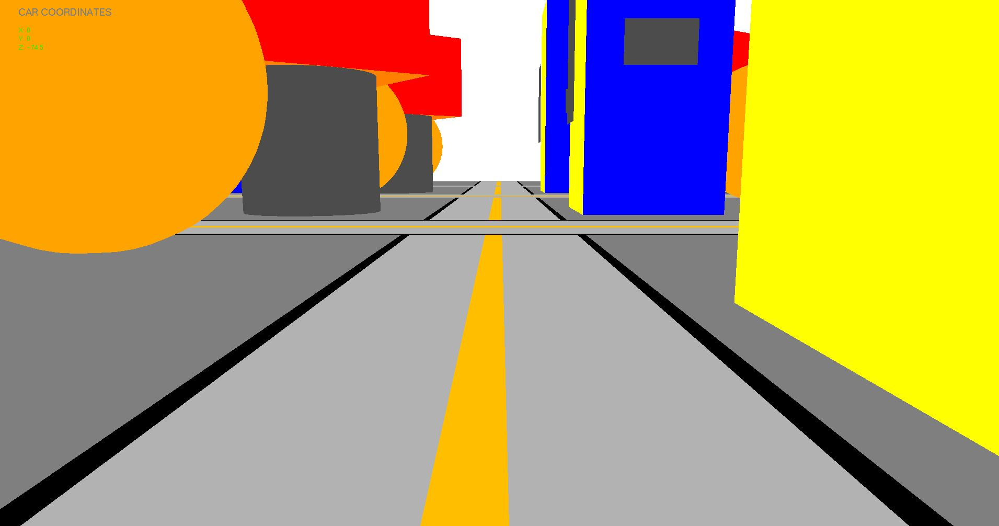

# CarSimulator

Car driving simulator made using OpenGL and C++.

# Controls:
a: forwards 
z: backwards 
q: turn left 
w: turn right 
F1: Look forward 
F2: Look right 
F3: Look left 
F4: Go back to default car view 
F5: Move camera back (+x) and right (-z) of vehicle 
F6: Move camera front (-x) and right (-z) of vehicle 
F7: Move camera front (-x) and left (+z) of vehicle 
F8: Move camera back (+x) and left (+z) of vehicle 
F9: Like F5 but farther away from vehicle 
F10: Like F6 but farther away from vehicle 
F11: Like F7 but farther away from vehicle 
F12: Like F8 but farther away from vehicle 

# In Game Images

